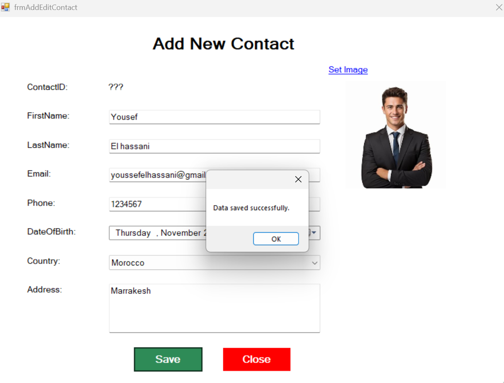
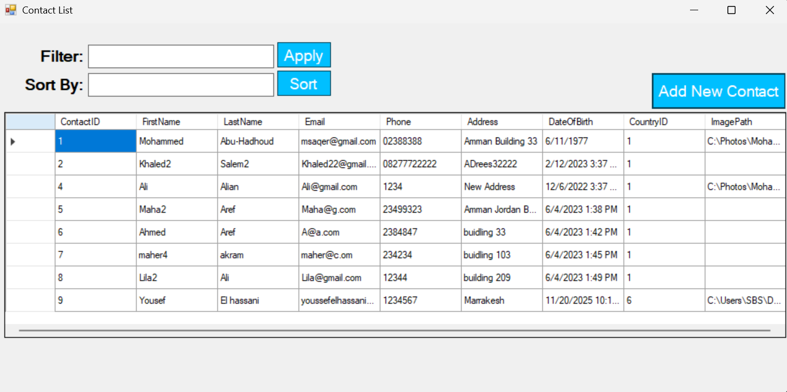
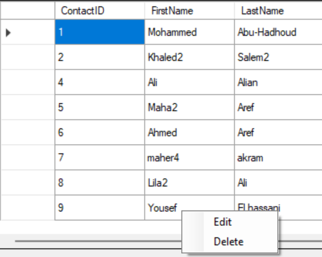
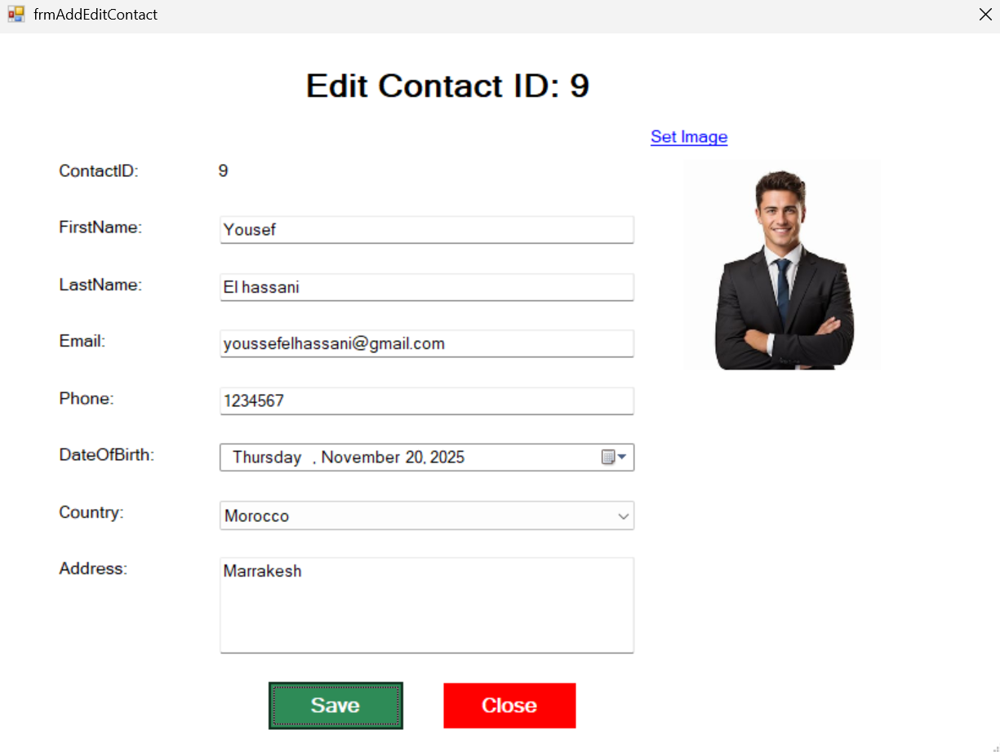

# 📇 Contacts Manager – Windows Forms App

A structured Windows Forms application for managing a list of contacts, built using a **3-tier architecture** to separate concerns and ensure maintainability. It supports full **CRUD operations** — users can **create**, **read**, **update**, and **delete** contact entries.

## 🏗️ Architecture
- **Presentation Layer**: Windows Forms UI for user interaction  
- **Business Logic Layer (BLL)**: Handles validation and processing  
- **Data Access Layer (DAL)**: Communicates with SQL Server for data operations

## 🔧 Tech Stack
- **C#** with **Windows Forms**
- **SQL Server** for persistent storage

## ✨ Features
- Display all contacts in a structured list
- Add new contacts with input validation
- Edit and update existing contact details
- Delete contacts with confirmation prompts
- Filter and sort contacts by various fields
- Clean separation of logic for scalability and testing

## 📷 Screenshots

### 🖥️ Main UI – Contact List with Filtering and Sorting and Add/Edit Contact Form


### ➕ Add Contact Form – Add New Contact Details



### Edit or Delete


### ✏️ Edit Contact Form – Update Existing Contact Information

.png)


## 📌 Status
✅ Fully functional and ready for portfolio showcase

## 🚀 How to Run
1. Clone the repository:
   ```bash
   git clone https://github.com/codebyyoussef/Contacts-Windows-Form-Project.git
